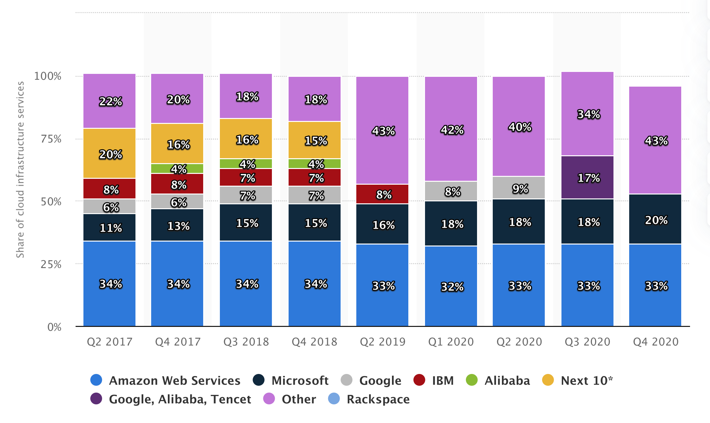

## Cloud Computing

Cloud computing is the on-demand availability of computer system resources, especially data storage (cloud storage) and computing power, without direct active management by the user. The term is generally used to describe data centers available to many users over the Internet. Large clouds, predominant today, often have functions distributed over multiple locations from central servers. Clouds may be limited to a single organization (enterprise clouds), or be available to multiple organizations (public cloud).

### Cloud History

Cloud computing history can trace its origins back to the 1950s when organizations with sufficient financial resources began using an increasingly complex and ever-changing system of mainframe computers to process their data. In those days, mainframe computers were huge and enormously expensive.

In 1955, John McCarthy, who originally coined the term “artificial intelligence” (AI), developed a theory of sharing computing time between an entire group of users. McCarthy’s theory of “time-sharing” was a conceptual vehicle for getting the most out of the computing time available – and making computing time available to smaller companies that couldn’t afford to buy their own mainframes.

IBM released an operating system called the VM (Virtual Machine) operating system in 1972, laying one of the foundation stones of the technology on which the current cloud is built. During the 1990s, several telecommunications companies offered their own versions of virtualized private networks (the earliest VPNs).

The arrival of Salesforce.com in 1999 introduced the concept of delivering enterprise applications via a simple website. In subsequent years, this paved the way for both specialist and mainstream software companies to start delivering applications over the internet – the Software as a Service (SaaS) cloud computing model.

On August 25, 2006, Amazon Web Services (AWS) launched Elastic Compute Cloud (EC2), enabling people to rent virtual computers and use their own programs and applications online.

In February 2010, Microsoft released Microsoft Azure, which was announced in October 2008.

On March 1, 2011, IBM announced the IBM SmartCloud framework to support Smarter Planet. Among the various components of the Smarter Computing foundation, cloud computing is a critical part. On June 7, 2012, Oracle announced the Oracle Cloud. This cloud offering is poised to be the first to provide users with access to an integrated set of IT solutions.

In May 2012, Google Compute Engine was released in preview, before being rolled out into General Availability in December 2013.

### Some terminologies

#### Infrastructure as a service (IaaS)

IaaS, is a step away from on-premises infrastructure. It’s a pay-as-you-go service where a third party provides you with infrastructure services, like storage and virtualization, as you need them, via a cloud, through the internet. 

As the user, you are responsible for the operating system and any data, applications, middleware, and runtimes, but a provider gives you access to, and management of, the network, servers, virtualization, and storage you need. 

#### Platform as a service (PaaS)

PaaS is another step further from full, on-premise infrastructure management. It is where a provider hosts the hardware and software on its own infrastructure and delivers this platform to the user as an integrated solution, solution stack, or service through an internet connection.

Primarily useful for developers and programmers, PaaS allows the user to develop, run, and manage their own apps without having to build and maintain the infrastructure or platform usually associated with the process. 

#### Software as a service (SaaS)
SaaS, also known as cloud application services, is the most comprehensive form of cloud computing services, delivering an entire application that is managed by a provider, via a web browser. 

Software updates, bug fixes, and general software maintenance are handled by the provider and the user connects to the app via a dashboard or API. There’s no installation of the software on individual machines and group access to the program is smoother and more reliable. 

#### Feature as a service (FaaS)

 is a category of cloud computing services that provides a platform allowing customers to develop, run, and manage application functionalities without the complexity of building and maintaining the infrastructure typically associated with developing and launching an app. Building an application following this model is one way of achieving a "serverless" architecture, and is typically used when building microservices applications.

### Cloud Market Share and Main Consumers

#### AWS Main Consumers
* Amazon
* Netflix
* Twitch
* LinkedIn
* Facebook
* Turner Broadcasting
* BBC
* Baidu
* ESPN
* Adobe

#### Google Cloud Platform Main Consumers

* Spotify
* HSBC
* Home Depot
* Snapchat
* HTC
* Best Buy
* Philips
* Coca Cola
* Domino's
* Feedly
* ShareThis
* Sony Music
* Ubisoft

#### Azure 

* Verizon
* MSI Computer
* LG Electronics
* CenturyLink
* NTT America
* Wikimedia Foundation
* LinkedIn Corp
* News Corp
* Adobe
* Intel

### Compare main cloud providers
 

### AWS IAM

IAM stands for “Identitiy and Access Management” and makes it possible to control access to your AWS services and resources.
IAM has different methods to control the access to AWS services.

#### Users
Create users if you want to grant other users access to your AWS account without sharing your login credentials.
#### Groups
Groups make it easy to manage access for multiple users.You could e.g. create a “servers” group with permissions to spin up EC2 instances and add multiple users to this group. This way the users in this group can create EC2 instances. Changes to permissions in this group affects all users who belong to that group.
### Policies
With policies you can define permissions for users, groups and roles. Policies are the building blocks to define what action can be performed for what resource.

### Roles
Roles are similar to users as they hold an AWS identity with permissions. Roles are often used if you e.g. want to grant access to AWS resources that the user normally doesn’t have.
Another scenario would be that you want to grant an application access to your AWS resources without exposing your AWS credentials.

### AWS S3

## More Contents
### To read
1. [What is Cloud Computing?](https://medium.com/future-vision/what-is-cloud-computing-713bd6c3b105)
2. [AWS vs Azure vs Google : The Public Cloud War](https://medium.com/@deveshsharma180399/aws-vs-azure-vs-google-the-public-cloud-war-fbcaadddd235)
3. [Everything you need to know about AWS S3](https://medium.com/manishmshiva/everything-you-need-to-know-about-aws-s3-cd77e6536965)

4. [Amazon Simple Storage Service Documentation](https://docs.aws.amazon.com/s3/index.html)
5. [AWS IAM Deep Dive. Chapter 1: Essentials](https://blog.tovmasyan.io/aws-iam-deep-dive-chapter-1-essentials-a9cfb1931a01)
### To watch
1. [How to Use Azure Active Directory with AWS SSO - AWS Online Tech Talks](https://www.youtube.com/watch?v=XW5amgAuRIo)
### Cheat Sheets
 