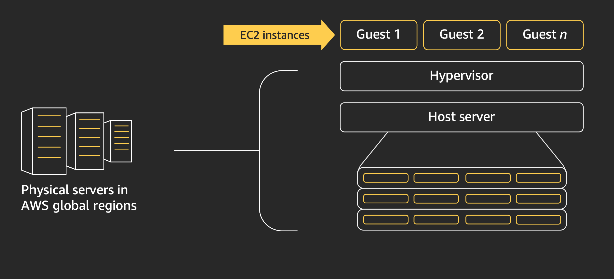
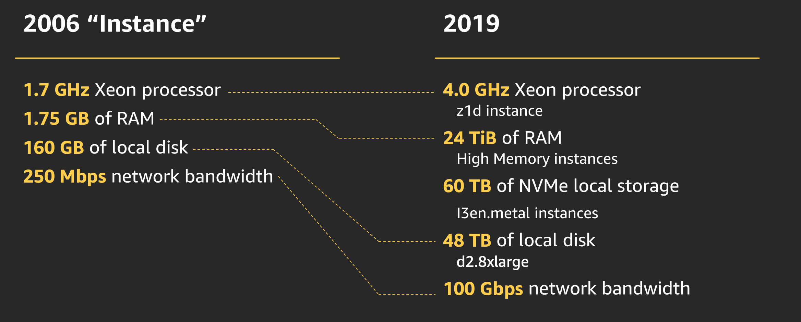
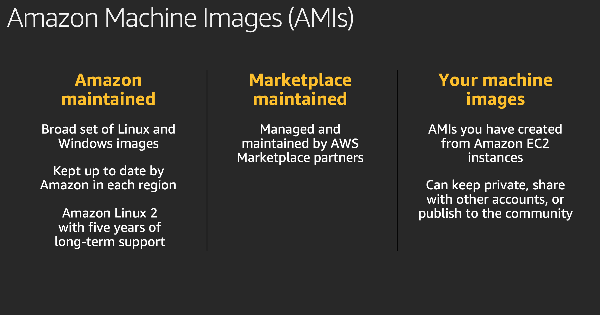
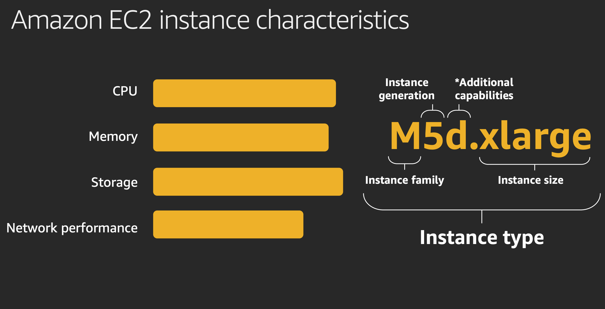
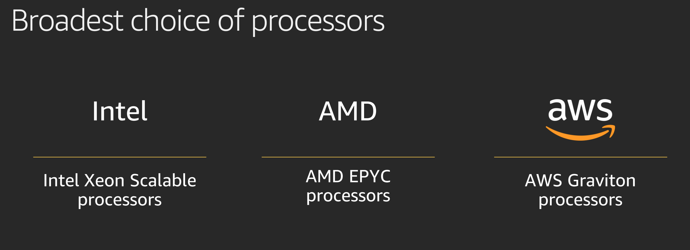
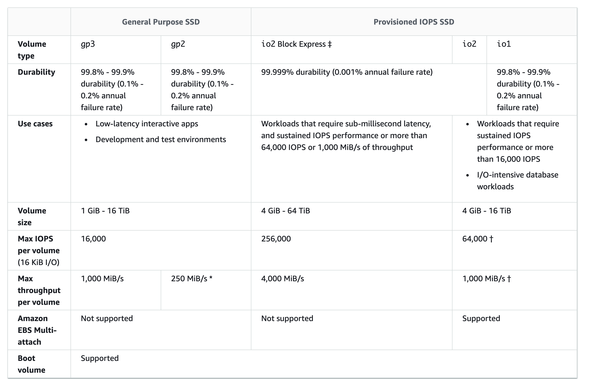
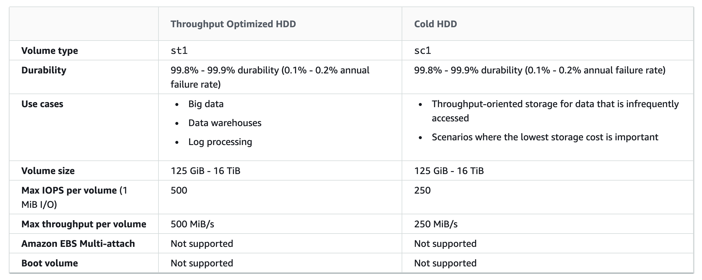

### AWS EC2
Elastic Compute Cloud or EC2 is a virtual server that assists users to run numerous applications on the AWS cloud infrastructure.
With AWS EC2, you get instances with different resource configurations of CPU, memory, storage, and networking. Each type is available in different sizes so that it can cater to the workload as required.

Instances come from Amazon Machine Images (AMI). These machine images act as a template that configures an operating system and determines the operating environment of the user. The users can also configure their own AMIs.

You can start deploying your cluster of servers as soon as you have selected your instance, along with the operating system of your choice. When it comes to creating an AWS EC2 instance, there are three popular ways you can use for this purpose.

### EC2 Instance types

### Benefits of AWS EC2
1. Long term commitment — You’re paying by the hour. You pay for whatever you use, instead of paying for the whole computing cloud.

2. Playspace — You can create additional instances for load testing (client and/or server), testing new architectures, rewrites, versions, etc.

3. Scaling. You can easily scale vertically (upgrade to a larger, two or four CPU instance) or horizontally using Amazon AWS EC2 servers.

4. Backup — You can also leverage it for backups, storage, and serving of large files, and even Simple DB for persistent storage.
Amazon EC2 offers excellent bandwidth which increases the time efficiency.

5. Less worry about hardware failure — Failures do occur, however, with AWS EC2, failures occur less often than a traditional dedicated server. Also, the recovery is much quicker and easier.

6. No CPU suffocation or other usage limitations — It is a common observation that many hosting providers kill long running script of users when they realize their servers are getting exhausted and might crash. With AWS, it ain’t a problem anymore.

7. Dedicated IP address — It’s yours and yours alone. As long as you keep your instance running, you can enhance security and increase privacy of your internal network.

### **Placement group**
When you launch a new EC2 instance, the EC2 service attempts to place the instance in such a way that all of your instances are spread out across underlying hardware to minimize correlated failures. You can use placement groups to influence the placement of a group of interdependent instances to meet the needs of your workload. Depending on the type of workload, you can create a placement group using one of the following placement strategies:

* **Cluster** – packs instances close together inside an Availability Zone. This strategy enables workloads to achieve the low-latency network performance necessary for tightly-coupled node-to-node communication that is typical of HPC applications.

* **Partition** – spreads your instances across logical partitions such that groups of instances in one partition do not share the underlying hardware with groups of instances in different partitions. This strategy is typically used by large distributed and replicated workloads, such as Hadoop, Cassandra, and Kafka.

* **Spread** – strictly places a small group of instances across distinct underlying hardware to reduce correlated failures.

### **Elastic Block Storage (EBS)**
Amazon Elastic Block Store (Amazon EBS) provides block level storage volumes for use with EC2 instances. EBS volumes behave like raw, unformatted block devices. You can mount these volumes as devices on your instances. EBS volumes that are attached to an instance are exposed as storage volumes that persist independently from the life of the instance. You can create a file system on top of these volumes, or use them in any way you would use a block device (such as a hard drive). You can dynamically change the configuration of a volume attached to an instance.

### **Amazon EC2 security groups**

A security group acts as a virtual firewall for your EC2 instances to control incoming and outgoing traffic. Inbound rules control the incoming traffic to your instance, and outbound rules control the outgoing traffic from your instance. When you launch an instance, you can specify one or more security groups. If you don't specify a security group, Amazon EC2 uses the default security group. You can add rules to each security group that allow traffic to or from its associated instances. You can modify the rules for a security group at any time. New and modified rules are automatically applied to all instances that are associated with the security group. When Amazon EC2 decides whether to allow traffic to reach an instance, it evaluates all of the rules from all of the security groups that are associated with the instance.

### More Contents
1. [Placement Groups in AWS](https://medium.com/an-idea/placement-groups-in-aws-531b0912178)
2. [Amazon EC2 foundation](https://www.youtube.com/watch?v=kMMybKqC2Y0)
3. [Amazon EBS volume types](https://docs.aws.amazon.com/AWSEC2/latest/UserGuide/ebs-volume-types.html)
4. [How to select EC2 Instance Type](https://medium.com/guardians-of-cloud/how-to-select-ec2-instance-type-3f5a91f837ad)
5. [Amazon EC2 Foundations](https://d1.awsstatic.com/events/reinvent/2019/REPEAT_2_Amazon_EC2_foundations_CMP211-R2.pdf)
6. [AWS re:Invent 2019: Amazon EC2 foundations](https://www.youtube.com/watch?v=kMMybKqC2Y0)